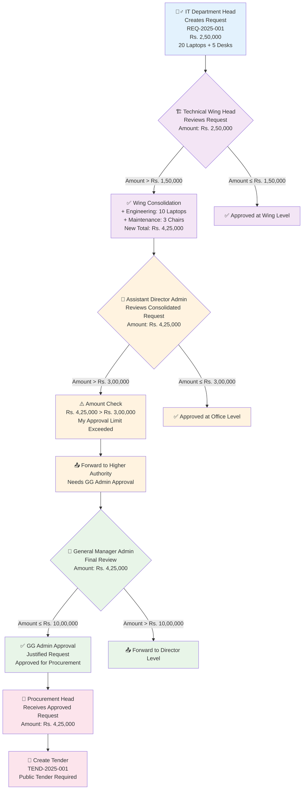
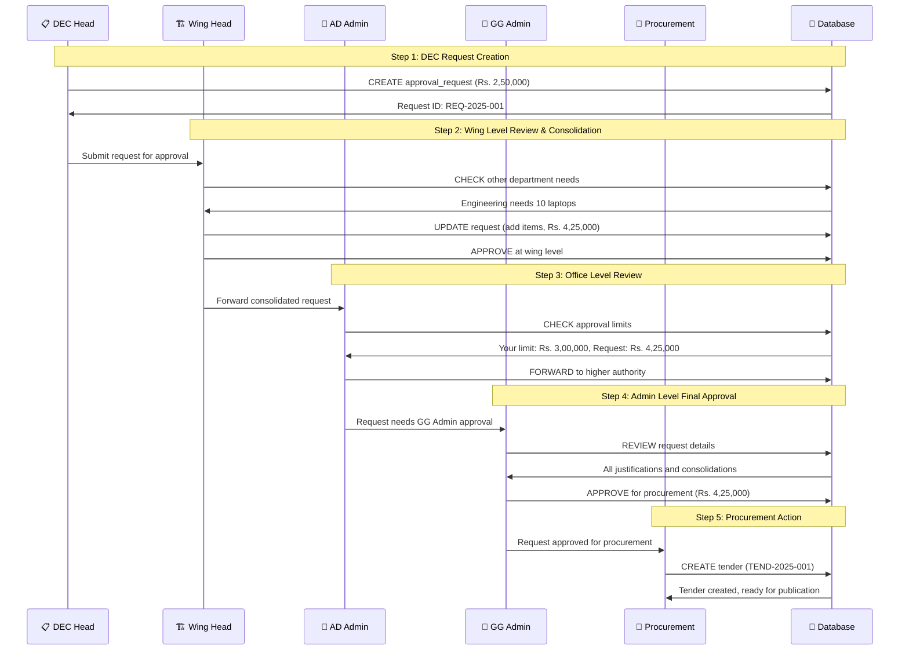
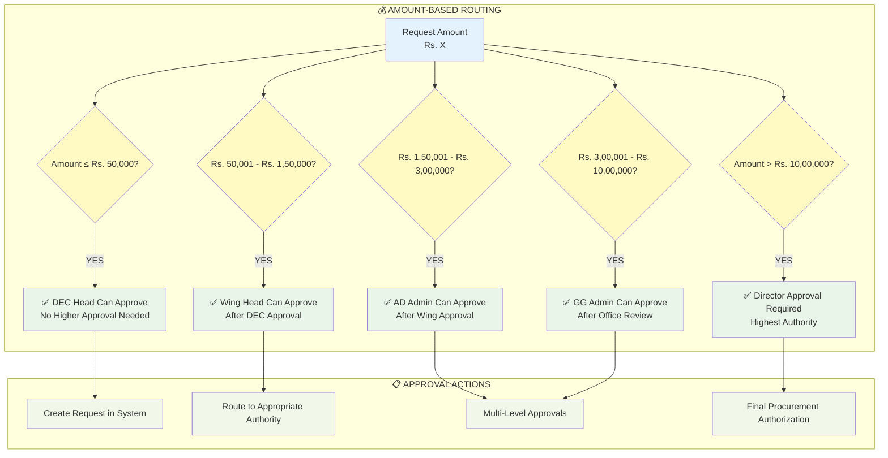

## 🔄 **APPROVAL HIERARCHY PYRAMID**

```mermaid
pyramid
    title Approval Authority Hierarchy
    
    "🎯 DIRECTOR LEVEL" : "Unlimited Authority<br/>Final Decision Maker<br/>Any Amount"
    "🏛️ GG ADMIN LEVEL" : "Up to Rs. 10,00,000<br/>Major Procurement<br/>Equipment & Furniture"
    "🏢 OFFICE LEVEL" : "Up to Rs. 3,00,000<br/>Office Requirements<br/>Departmental Needs"
    "🏗️ WING LEVEL" : "Up to Rs. 1,50,000<br/>Wing Consolidation<br/>Multi-Department"
    "📋 DEC LEVEL" : "Up to Rs. 50,000<br/>Basic Supplies<br/>Minor Items"
```

## 📊 **APPROVAL FLOW SEQUENCE**



## 📋 **APPROVAL DECISION MATRIX**


