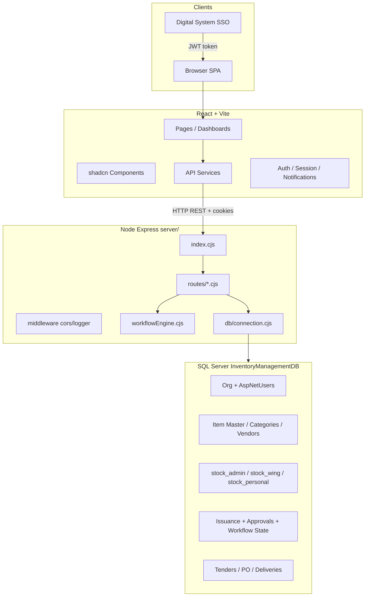
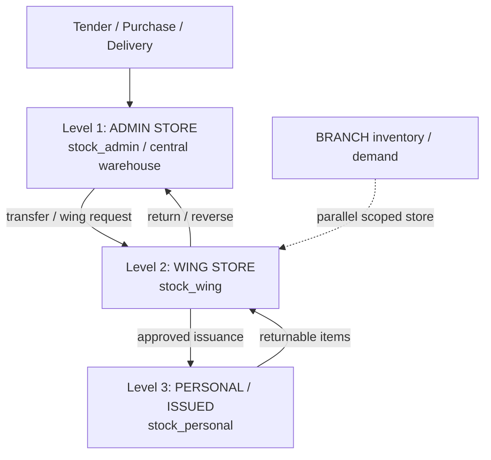
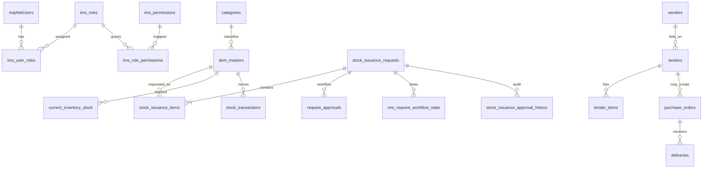
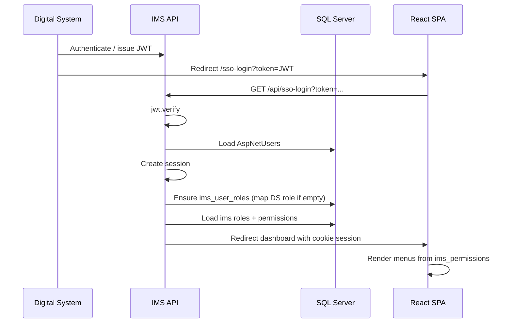
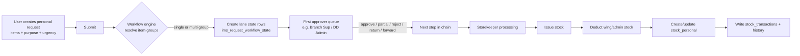
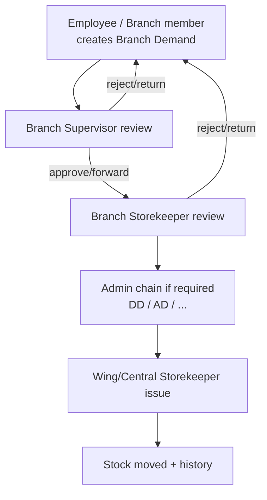
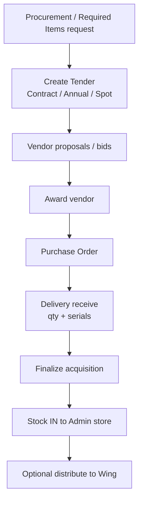
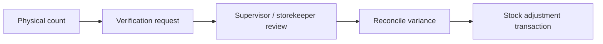
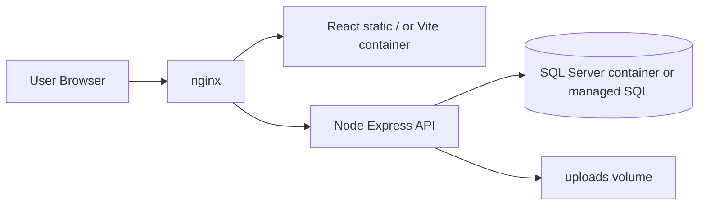

# IMS v1 — Full System Understanding
## Blueprint for Docker + SQL Server + React + Node (Antigravity) Environment

**Source codebase:** `ims-v1`  
**Purpose:** Complete descriptive map of architecture, database, workflows, roles, APIs, and UI/UX so the system can be recreated cleanly in a new containerized environment.

---

## 1. What This System Is

**Inventory Management System (IMS)** is an enterprise web app for a large organization (ECP / Digital System integrated) that manages the full inventory lifecycle:

1. **Buy stock** (procurement / tenders / awards / delivery)
2. **Hold stock** at three hierarchy levels (Admin → Wing → Personal/Branch)
3. **Issue stock** through multi-step role-based approvals
4. **Verify / return / report** stock movements

It is **not** a simple CRUD inventory app. The core complexity is:

- Organizational hierarchy (Office → Wing → Branch → User)
- Dynamic multi-lane approval workflows by **item group**
- Dual identity systems (AspNetUsers for login + `ims_roles` for app permissions)
- SSO from an external Digital System (DS)

---

## 2. Technology Stack (Current)

| Layer | Technology |
|--------|------------|
| Frontend | React 18 + TypeScript + Vite |
| UI kit | shadcn/ui + Radix UI + Tailwind CSS |
| State / data | TanStack React Query, React Context (Auth/Session/Notifications) |
| Routing | React Router v6 |
| Forms | react-hook-form + zod |
| Charts / PDF | recharts, jspdf |
| Backend | Node.js + Express 5 (CommonJS `.cjs`) |
| Auth | express-session + JWT (SSO) + AspNet Identity password hashes |
| DB driver | `mssql` (+ optional `msnodesqlv8`) |
| Database | Microsoft SQL Server — `InventoryManagementDB` |
| Upload | multer → `/uploads` |
| E2E | Playwright |
| Existing Docker | Multi-stage Dockerfile + `docker-compose.prod.yml` (API + nginx + prometheus/grafana; SQL usually external) |

### Runtime ports (typical local)

| Service | Port |
|---------|------|
| Vite frontend | `5173` |
| Express API | `3001` (config-driven; prod compose often `5000`) |
| Vite preview (built) | `4173` |

### Key scripts (`package.json`)

```bash
npm run dev          # frontend only
npm run backend      # node server/index.cjs
npm run dev:full     # both
npm run build        # vite production build
```

---

## 3. High-Level Architecture



### Layer responsibilities

1. **Frontend** — role-filtered menus, forms, approval UIs, reports  
2. **API** — validation, workflow advancement, stock mutations, auth  
3. **SQL Server** — source of truth; heavy use of tables, views, SPs, soft-delete flags  
4. **Workflow engine** — picks next approver from `ims_roles` + dynamic steps by item `group_number`

---

## 4. Project Structure (What Matters)

```
ims-v1/
├── src/
│   ├── App.tsx                 # All routes
│   ├── pages/                  # ~100+ page screens
│   ├── components/
│   │   ├── layout/             # Layout, AppSidebar, Navbar
│   │   ├── ui/                 # shadcn primitives
│   │   ├── stock-issuance/     # issuance UX
│   │   ├── tenders/            # tender UX
│   │   └── Approval*.tsx       # approval dashboards
│   ├── contexts/               # Auth, Session, Notifications
│   ├── services/               # Frontend API clients
│   ├── hooks/                  # usePermission, etc.
│   └── index.css               # design tokens + Tailwind
├── server/
│   ├── index.cjs               # Express bootstrap + route mounts
│   ├── config/env.cjs
│   ├── db/connection.cjs       # mssql pool
│   ├── middleware/
│   ├── routes/                 # domain APIs (see §8)
│   └── utils/workflowEngine.cjs
├── database/migrations/        # incremental SQL
├── docs/                       # schema + architecture docs
├── Dockerfile / docker-compose*.yml
└── many *.sql historical migrations (root-level)
```

**Important for Antigravity rebuild:** treat root-level SQL files as **evolution history**. Prefer a clean ordered migration set derived from current production schema, not replaying every historical script blindly.

---

## 5. Organizational & Inventory Model

### 5.1 Org hierarchy

```
Office (Offices)
  └── Wing (Wings)
        └── Branch (optional)
              └── User (AspNetUsers)
```

Users carry org fields such as:

- `intOfficeID` / office
- `intWingID` / wing
- branch id (where used)
- `FullName`, `Email`, `UserName`
- password hash compatible with ASP.NET Identity

### 5.2 Three-level inventory



| Level | Concept | Who manages |
|-------|---------|-------------|
| 1 Admin | Central warehouse | Admin / storekeeper / central inventory roles |
| 2 Wing | Department stock | Wing supervisor / wing storekeeper |
| 3 Personal | Items with a person | End user; returns go back up |
| Branch | Branch-scoped stock/demand | Branch supervisor / branch storekeeper |

Each level tracks quantities like current / available / reserved and status (Available, Low Stock, Out of Stock, etc.).

---

## 6. Database Structure (Conceptual ER)

Database: **`InventoryManagementDB`** (SQL Server). Docs reference ~60+ tables.

### 6.1 Domain map



### 6.2 Master data

| Table | Purpose |
|-------|---------|
| `item_masters` | Canonical items (code, name, category, UOM, manufacturer, `group_number`, dispensable, soft-delete) |
| `categories` / subcategories | Taxonomy; category codes; dispensable flags |
| `vendors` | Suppliers |
| `Offices`, `Wings`, branches/DECs | Org structure |
| designation / DEC codes | Government/code mappings |

**Item groups (`group_number` 1–6)** drive which approval chain is used. Group can also be inferred from item description text (`GROUP-I`, `GROUP-II`, …).

### 6.3 Stock & movements

| Table / concept | Purpose |
|-----------------|---------|
| `current_inventory_stock` | Live quantities + reorder levels (legacy/central view) |
| `stock_admin` | Central warehouse balances |
| `stock_wing` | Per-wing balances |
| `stock_personal` | Issued-to-user holdings + return status |
| `stock_transactions` / movement logs | Audit of IN/OUT/ADJUSTMENT/RETURN |
| `stock_returns` + return items | Return workflow |
| opening balance tables/flows | Initial stock entry / go-live |

### 6.4 Stock issuance & approvals (core operational domain)

| Table | Purpose |
|-------|---------|
| `stock_issuance_requests` | Header: request number, type (Individual/Organizational/Branch/Wing), purpose, urgency, returnable, org refs, `approval_status`, supervisor/admin fields, timestamps |
| `stock_issuance_items` | Line items: item_master, nomenclature, requested/approved/issued qty, item_status, pricing |
| `request_approvals` | Live approval assignment (`current_approver_id`, status, `is_admin_workflow`, …) |
| `stock_issuance_approval_history` | Immutable action log (approve/reject/forward/return) + `actor_role_id` |
| `ims_dynamic_workflow_steps` | Configurable steps per `group_number` + role designation |
| `ims_request_workflow_state` | Per-request **lane** state: `(request_id, group_number)`, step order, current approver, status |
| approval item tables | Per-item decisions when mixed approve/reject |

**Typical request statuses (evolved over time):**  
`Pending Supervisor Review`, `Forwarded to Admin`, `Pending Admin Review`, `Approved`, `Partially Approved`, `Rejected`, `Returned`, `Issued`, `Finalized`, storekeeper queue states, etc.

### 6.5 Procurement / tender domain

| Table | Purpose |
|-------|---------|
| `procurement_requests` (+ items) | Demand to buy |
| `tenders` / annual tenders | Tender headers (contract / spot / annual types) |
| `tender_items` | Lines + vendor/price fields |
| bids / awards / bidders | Evaluation & award |
| `purchase_orders` | PO after award |
| deliveries + serial numbers | Goods receipt into admin stock |
| stock acquisitions | Acquisition tracking / finalize |

### 6.6 Auth & RBAC (two layers)

**Layer A — Identity (login)**

| Table | Purpose |
|-------|---------|
| `AspNetUsers` | Credentials, profile, wing/office |
| `AspNetRoles` / `AspNetUserRoles` | DS / legacy roles (still used in older SQL views) |
| claims/logins/tokens | Identity extras |

**Layer B — IMS application RBAC (preferred for menus/APIs)**

| Table | Purpose |
|-------|---------|
| `ims_roles` | App roles (`WING_SUPERVISOR`, `DD Admin`, `Storekeeper`, …) |
| `ims_permissions` | Keys like `inventory.view`, `approval.approve` |
| `ims_role_permissions` | Role → permission |
| `ims_user_roles` | User → role with **scope** (Global/Office/Wing/Branch) |
| `ims_role_audit_log` | Assignment audit |

Workflow engine specifically resolves approvers from **`ims_roles` + `ims_user_roles`**, not only AspNetRoles.

### 6.7 Supporting

- Notifications table  
- Verification / pending verification tables  
- Financial year settings / system go-live date  
- Soft-delete columns (`is_deleted`) widely used  
- Many SQL **views** for dashboards (pending supervisor/admin, my requests, wing supervisors)

---

## 7. Roles, Permissions & Menu Visibility

### 7.1 Major IMS roles

| Role | Intent |
|------|--------|
| `IMS_SUPER_ADMIN` | Everything incl. role management |
| `IMS_ADMIN` / `Administrator` | Broad admin without full role-mgmt |
| `DG Admin` | Top admin chain |
| `DD Admin` | Admin chain start for many personal requests |
| `AD Admin-I`, `AD Admin-II` | Mid admin approvers |
| `Storekeeper` / wing-branch storekeeper variants | Issue stock, verifications, processing |
| `WING_SUPERVISOR` | Wing inventory + wing approvals |
| `BRANCH_SUPERVISOR` / custom branch variants | Branch demand & review |
| `Branch Storekeeper` | Branch request review |
| `Transport Supervisor` | Special workflow group role |
| General user | Personal request + own inventory |

### 7.2 Permission keys (examples)

```
admin.super
roles.manage
users.assign_roles
inventory.view / inventory.manage
inventory.manage_store_keeper
procurement.view / manage / request / approve
issuance.request / process / view
approval.approve
reports.view
wing.supervisor
categories.manage
items.manage
```

### 7.3 Sidebar menu groups (look & navigation model)

From `AppSidebar.tsx`, menus are **permission- and role-gated**:

| Menu group | Typical audience | Key screens |
|------------|------------------|-------------|
| **Personal** | Everyone | Personal dashboard, request form, my requests, stock return, my inventory |
| **Supervisor** | Approvers | Supervisor approval dashboard, requisition report |
| **Wing Menu** | Wing supervisor | Wing dashboard, history, inventory, members |
| **Branch Menu** | Branch roles | Branch dashboard, demand, inventory, members |
| **Store Keeper Menu** | Storekeepers | Branch review, verifications, wing inventory, process issuance |
| **Meta Data** | Inventory managers | Item master, categories, vendors |
| **Inventory Menu** | Central inventory | Dashboard, opening balance, stock qty, alerts |
| **Procurement Menu** | Procurement | Contract/tender, annual tenders, petty purchase, required items |
| **Stock Issuance Menu** | Issuance ops | Issuance dashboard, process, historical, transactions |
| **Request History** | Approvers | Future / rejected / pending buckets |
| **Admin** | AD/DD/DG/storekeeper chain | Scoped approval dashboards + workflow config |
| **Super Admin** | Super admin | Full admin + role assignment |

---

## 8. Backend API Surface

Mounted in `server/index.cjs`:

| Mount | Domain |
|-------|--------|
| `/api/auth`, `/api/session`, `/api/sso-login` | Login, session, SSO |
| `/api/users`, `/api/ims/users` | Users / org helpers |
| `/api/approvals` | Approve / reject / forward / my queue |
| `/api/permissions` | Permission checks / admin |
| `/api/stock-issuance` | Create/list/process issuance requests |
| `/api/inventory`, `/api/inventory-stock` | Stock queries/updates |
| `/api/wing-inventory`, `/api/branch-inventory` | Scoped inventory + histories |
| `/api/items-master`, `/api/item-masters` | Item master |
| `/api/categories`, `/api/sub-categories` | Taxonomy |
| `/api/vendors` | Vendors |
| `/api/tenders`, `/api/tender-items`, `/api/annual-tenders` | Tendering |
| `/api/purchase-orders` | POs |
| `/api/deliveries` | Receiving |
| `/api/stock-acquisitions` | Acquisition finalize |
| `/api/stock-returns` | Returns |
| `/api/reorder-requests` | Reorder |
| `/api/required-items` | Required items pipeline |
| `/api/reports` | Reporting |
| `/api/health` | Healthcheck |
| `/uploads` | Static files |

Pattern: **REST + JSON**, session cookie for browser auth, parameterized SQL via `mssql`.

---

## 9. Authentication Flows

### 9.1 Local login

1. User posts credentials  
2. Backend verifies against `AspNetUsers` (ASP.NET Identity hash or bcrypt depending on path)  
3. Session created (`express-session`)  
4. IMS roles/permissions loaded into session  
5. Frontend `SessionContext` / `AuthContext` drive UI

### 9.2 SSO from Digital System (DS)



DS role → default IMS role mapping (when user has no IMS roles yet):

| DS role | Default IMS role |
|---------|------------------|
| Administrator | IMS_SUPER_ADMIN |
| Supervisor | WING_SUPERVISOR |
| StoreKeeper | WING_STORE_KEEPER |
| User | GENERAL_USER |

---

## 10. Core Business Workflows

### 10.1 Stock issuance — the heart of the system

#### Request types

- **Individual / Personal** — employee needs items for self  
- **Organizational / Wing** — wing-level demand  
- **Branch demand** — branch-scoped request path with branch supervisor/storekeeper

#### High-level personal request flow



#### Admin chain (typical, from workflow engine constants)

Workflow-relevant role names include:

- Branch Supervisor / CUSTOM_BRANCH_SUPERVISOR  
- DD Admin → AD Admin-I → AD Admin-II → Storekeeper  
- DG Admin, Transport Supervisor, Branch Storekeeper variants  

**Admin chain start often:** `DD Admin`  
**Admin chain progression often:** `DD Admin` → `AD Admin-I` → `AD Admin-II` → `Storekeeper`

Exact chain is **data-driven** via `ims_dynamic_workflow_steps` per **item group**.

#### Multi-lane / mixed-group behavior

- Each item belongs to a **group_number** (1–6)  
- A request with multiple groups can create **multiple workflow lanes**  
- Each lane has its own `current_step_order`, `current_approver_id`, status  
- Parent request status is a rollup of lane outcomes  
- Approvers act **per item** (approve qty, reject with reason, forward)

#### Per-item decisions

Approvers can:

- Approve full/partial quantity  
- Reject with reason  
- Forward to another role/user  
- Return to requester for correction (`Returned` → edit page)

#### Issuance completion

Storekeeper / processing screen:

- Sees approved quantities  
- Issues stock  
- System reduces source inventory  
- Creates personal holdings if applicable  
- Marks request/items issued/finalized  
- Full audit in history + transactions

### 10.2 Branch request workflow (simple view)



### 10.3 Procurement → tender → stock in



Tender UI uses color coding by type:

- Purple — Contract  
- Orange — Spot / Petty purchase  
- Indigo — Annual tender  

### 10.4 Stock verification



Storekeeper has dedicated **Forwarded Verifications** queue.

### 10.5 Stock return

User returns issued returnable items → review → accept/reject condition → stock moves back up hierarchy → transactions logged.

### 10.6 Reorder

When `quantity < reorder_level`, alerts surface; can feed required-items / procurement path.

---

## 11. Workflow Engine Internals (for rebuild)

File: `server/utils/workflowEngine.cjs`

Responsibilities:

1. Ensure workflow tables exist (`ims_dynamic_workflow_steps`, `ims_request_workflow_state`, columns on `request_approvals`, `item_masters.group_number`)  
2. Resolve item group(s) from request lines  
3. Load ordered steps for a group  
4. **Pick approver** matching step designation against users who hold workflow roles in `ims_user_roles`  
5. Advance / complete / multi-lane rollup  
6. Keep `current_approver_id` in sync for “my approvals” queues  

**Rebuild rule:** do not hardcode only UI role names — seed `ims_dynamic_workflow_steps` and role assignments the same way production does.

---

## 12. Frontend Screens Map (by domain)

### Entry & auth
- `/login`, `/sso-login`, `/ds-landing`, `/personal-ims`

### Dashboards
- Smart dashboard `/`  
- Personal / user dashboards  
- Wing / Branch / Inventory / Issuance dashboards  

### Issuance & approvals
- Personal / wing / branch request forms  
- My requests, request details, returned edit  
- Approval dashboards (supervisor, admin, request-based, scoped personal/branch/wing)  
- Stock issuance processing  
- Request history (future/rejected/pending)  

### Inventory
- Item master, categories, subcategories  
- Stock quantities, alerts, opening balance  
- Personal / wing / branch inventory  
- Stock transactions, returns, historical issuance  

### Procurement
- Unified / contract tender, annual tenders, spot purchases  
- Vendor management / proposals  
- PO create/edit/details/dashboard  
- Receive delivery / receiving report  
- Required items, admin procurement review  

### Admin
- Role management, user role assignment  
- Workflow admin config  
- Notifications  
- Reports / analytics / yearwise / delivery / tender reports  

---

## 13. Look & Feel (Design System)

### Visual identity

- **Modern enterprise SaaS** aesthetic  
- **shadcn/ui** components on **Radix** primitives  
- **Tailwind** utility layout  
- Default **light mode**; class-based **dark mode** (`next-themes`, storage key `ims-portal-theme`)  
- Font: Inter / Roboto / system UI stack  
- Radius: `0.5rem` cards/buttons  
- Dense but readable tables; card-based dashboards; status badges  

### Color language

| Token / color | Use |
|---------------|-----|
| Slate primary (`222.2 47.4% 11.2%`) | Primary text/actions in base theme |
| Blue (`blue-600`) | Primary CTAs, links, info |
| Green | Success, approved, positive stock |
| Red | Destructive, rejected, errors |
| Amber | Warnings, pending attention |
| Purple / Orange / Indigo | Tender type badges |
| Teal accents (legacy CSS classes) | Some sidebar/link styles in `index.css` |
| Sidebar light gray / dark slate | App shell |

### UX patterns

- **Left collapsible sidebar** with grouped menus + icons (lucide-react)  
- **Top bar** user/session/logout  
- **Permission gates** hide entire menu sections  
- **Cards** with header/title/description + content  
- **Data tables** with filters, status chips, action buttons  
- **Multi-step / wizard** flows for tenders & receiving  
- **Per-item approval panels** (not only whole-request approve)  
- **Toasts** (sonner + shadcn toaster)  
- **Dialogs / sheets / hover-cards** for details  
- KPI tiles on dashboards (counts pending, stock value, alerts)  
- Print/PDF export on several reports  

### Interaction principles to preserve in Antigravity rebuild

1. Role-first navigation (user only sees their world)  
2. Request timeline / history always visible on detail pages  
3. Status colors consistent across lists  
4. Forms validate before submit; show server errors clearly  
5. Approver screens optimized for queue processing (list → detail → decide → next)  
6. Mobile-tolerant but **desktop-first** (approval tables need width)

---

## 14. Cross-Cutting Concerns

| Concern | How IMS handles it |
|---------|-------------------|
| Soft delete | `is_deleted` flags; UI often hides delete or soft-deletes |
| Audit | approval history, stock transactions, role audit log |
| File uploads | multer + `/uploads` static |
| Env switching | many `.env.*` + `switch-env.ps1` (dev/test/prod) |
| CORS / sessions | cookie session, `sameSite: 'lax'`, credentials from SPA |
| Health | `/api/health` + docker healthcheck.js |
| Testing | Playwright e2e workflow regression |
| Logging | request logger middleware; assorted debug scripts in repo root |

---

## 15. Recommended Docker Target Topology (for Antigravity)



Suggested compose services:

1. **`db`** — `mcr.microsoft.com/mssql/server` with persistent volume  
2. **`api`** — Node 18/20, `server/index.cjs`, env for SQL  
3. **`web`** — nginx serving `dist/` + reverse proxy `/api` → api  
4. Optional: mail/redis later (not core today)

### Env essentials

```
NODE_ENV=
PORT=
DB_HOST=
DB_PORT=1433
DB_NAME=InventoryManagementDB
DB_USER=
DB_PASSWORD=
SESSION_SECRET=
JWT_SECRET=
```

### Migration strategy for new env

1. Export **schema + critical seed** from current SQL (roles, permissions, workflow steps, org, item masters)  
2. Create ordered migrations under `database/migrations`  
3. Seed system roles + dynamic workflow steps  
4. Sync/import users (AspNetUsers)  
5. Verify: login → create personal request → approve lane → issue → stock movement  
6. Verify: tender → award → delivery → admin stock increase  

---

## 16. Mental Model Summary (One Paragraph)

IMS is a **hierarchical stock operating system**: goods enter through **procurement/tenders/deliveries** into an **admin warehouse**, can move to **wing/branch stores**, and leave to people only after a **configurable multi-role approval workflow** driven by **item groups** and **IMS RBAC**. The UI is a **permission-filtered React admin portal** (shadcn/Tailwind) talking to a **Node/Express API** on **SQL Server**, with **SSO** from a parent Digital System. Rebuild success means preserving org scope, dual auth tables, multi-lane approvals, three-level stock, and the same role-based look-and-feel—not just CRUD screens.

---

## 17. Key Source Files to Study First in New Env

| Priority | Path | Why |
|----------|------|-----|
| P0 | `server/index.cjs` | API map |
| P0 | `server/utils/workflowEngine.cjs` | Approval brain |
| P0 | `server/routes/stockIssuance.cjs` | Request create/issue |
| P0 | `server/routes/approvals.cjs` | Approve/forward queues |
| P0 | `server/routes/auth.cjs` | Login + SSO |
| P0 | `src/components/layout/AppSidebar.tsx` | UX IA + role gates |
| P0 | `src/App.tsx` | Full route inventory |
| P1 | `docs/DATABASE-SCHEMA.md` | Table reference |
| P1 | `INVENTORY-SYSTEM-ARCHITECTURE.md` | 3-level stock |
| P1 | `create-ims-role-system.sql` | RBAC schema |
| P1 | `IMS-THEME-DESIGN-SYSTEM.md` | Visual system |
| P1 | `SSO-ROLE-AUTHENTICATION-FLOW.md` | Auth sequence |

---

## 18. Glossary

| Term | Meaning |
|------|---------|
| Wing | Department/unit under an office |
| Branch | Sub-unit under wing (optional path) |
| Item group | Classification 1–6 controlling approval chain |
| Lane | Independent workflow path for one group inside one request |
| Storekeeper | Role that physically issues/receives stock |
| DEC | Designation/equivalence code mapping |
| DS | External Digital System (SSO parent) |
| Soft delete | Row hidden via flag, not physically removed |
| Finalized | Terminal processed state for some documents |

---

*Generated as a migration blueprint for recreating IMS v1 under Docker + SQL Server + React + Node (Antigravity).*
