```mermaid
graph TB
    %% PHASE 1: SYSTEM SETUP
    subgraph "🏗️ PHASE 1: SYSTEM SETUP"
        A1[👤 Admin Creates Master Data]
        A2[📋 Categories & Sub-Categories]
        A3[🏢 Departments & Suppliers]
        A4[📦 Item Masters]
        A5[📊 Initial Stock Count]
        
        A1 --> A2
        A2 --> A3
        A3 --> A4
        A4 --> A5
    end
    
    %% PHASE 2: PROCUREMENT
    subgraph "🛒 PHASE 2: PROCUREMENT WORKFLOW"
        B1[📝 Create Purchase Order]
        B2[📧 Send to Supplier]
        B3[📦 Goods Received]
        B4[✅ Verify & Accept]
        B5[💾 Create RECEIVED Transaction]
        B6[📈 Stock Level Increases]
        
        B1 --> B2
        B2 --> B3
        B3 --> B4
        B4 --> B5
        B5 --> B6
    end
    
    %% PHASE 3: ISSUANCE
    subgraph "📤 PHASE 3: ISSUANCE WORKFLOW"  
        C1[🙋‍♂️ Department Requests Stock]
        C2[📋 Create Issuance Request]
        C3[✅ Store Manager Approves]
        C4[📦 Physical Stock Issue]
        C5[💾 Create ISSUED Transaction]
        C6[📉 Stock Level Decreases]
        
        C1 --> C2
        C2 --> C3
        C3 --> C4
        C4 --> C5
        C5 --> C6
    end
    
    %% PHASE 4: RETURNS
    subgraph "🔙 PHASE 4: RETURNS WORKFLOW"
        D1[↩️ Department Returns Items]
        D2[📝 Create Return Request] 
        D3[🔍 Store Staff Inspects]
        D4[✅ Accept/Reject Items]
        D5[💾 Create RETURNED Transaction]
        D6[📈 Stock Level Increases]
        
        D1 --> D2
        D2 --> D3
        D3 --> D4
        D4 --> D5
        D5 --> D6
    end
    
    %% PHASE 5: MONITORING
    subgraph "📊 PHASE 5: MONITORING & REPORTING"
        E1[📈 Real-time Dashboard]
        E2[🚨 Automated Alerts]
        E3[📊 Stock Reports]
        E4[📋 Audit Reports]
        E5[📅 Planning & Analysis]
        
        E1 --> E2
        E2 --> E3
        E3 --> E4
        E4 --> E5
    end
    
    %% CENTRAL DATABASE
    subgraph "💾 CENTRAL TRANSACTION DATABASE"
        F1[(stock_transactions)]
        F2[(current_stock_levels)]
        F3[🔄 Auto-Calculate Stock]
        F4[📋 Complete Audit Trail]
        
        F1 --> F3
        F3 --> F2
        F1 --> F4
    end
    
    %% CONNECTIONS BETWEEN PHASES
    A5 --> F1
    B5 --> F1
    C5 --> F1 
    D5 --> F1
    F2 --> E1
    
    %% CONTINUOUS LOOP
    E5 --> B1
    E2 --> B1
    
    %% STYLING
    classDef setupPhase fill:#e1f5fe
    classDef procurementPhase fill:#f3e5f5
    classDef issuancePhase fill:#fff3e0
    classDef returnsPhase fill:#e8f5e8
    classDef monitoringPhase fill:#fce4ec
    classDef databasePhase fill:#fff9c4
    
    class A1,A2,A3,A4,A5 setupPhase
    class B1,B2,B3,B4,B5,B6 procurementPhase
    class C1,C2,C3,C4,C5,C6 issuancePhase
    class D1,D2,D3,D4,D5,D6 returnsPhase
    class E1,E2,E3,E4,E5 monitoringPhase
    class F1,F2,F3,F4 databasePhase
```

## 🔄 **TRANSACTION FLOW DIAGRAM**

```mermaid
graph LR
    %% TRANSACTION TYPES
    subgraph "📦 STOCK INCREASES (+)"
        T1[INITIAL<br/>+50 units]
        T2[RECEIVED<br/>+100 units]
        T3[RETURNED<br/>+3 units]
        T4[ADJUSTMENT<br/>+/-5 units]
    end
    
    subgraph "📤 STOCK DECREASES (-)" 
        T5[ISSUED<br/>-25 units]
        T6[DAMAGED<br/>-2 units]
        T7[EXPIRED<br/>-1 units]
        T8[ADJUSTMENT<br/>+/-5 units]
    end
    
    %% CENTRAL CALCULATION
    subgraph "🧮 CURRENT STOCK CALCULATION"
        CALC[Current Stock = <br/>INITIAL + RECEIVED + RETURNED<br/>- ISSUED - DAMAGED - EXPIRED<br/>± ADJUSTMENTS]
        RESULT[📊 Result: 125 units]
    end
    
    %% FLOWS
    T1 --> CALC
    T2 --> CALC
    T3 --> CALC
    T4 --> CALC
    T5 --> CALC
    T6 --> CALC
    T7 --> CALC
    T8 --> CALC
    
    CALC --> RESULT
    
    %% STYLING
    classDef increase fill:#c8e6c9
    classDef decrease fill:#ffcdd2
    classDef calculation fill:#fff9c4
    classDef result fill:#bbdefb
    
    class T1,T2,T3 increase
    class T5,T6,T7 decrease  
    class T4,T8 calculation
    class CALC calculation
    class RESULT result
```

## 🎯 **USER ROLE WORKFLOW**

```mermaid
graph TD
    %% USER ROLES
    subgraph "👥 USER ROLES & RESPONSIBILITIES"
        U1[🔧 System Admin<br/>Master Data Setup]
        U2[👨‍💼 Store Manager<br/>Approvals & POs]
        U3[👷‍♂️ Store Staff<br/>Physical Operations]
        U4[👔 Department Head<br/>Requests & Returns]
        U5[👤 Department Staff<br/>View & Submit]
    end
    
    %% OPERATIONS
    subgraph "⚙️ OPERATIONS"
        O1[📋 Master Data Management]
        O2[🛒 Purchase Orders]
        O3[📦 Goods Receipt]
        O4[📤 Stock Issuance]
        O5[🔙 Stock Returns]
        O6[📊 Reports & Analytics]
    end
    
    %% CONNECTIONS
    U1 --> O1
    U1 --> O6
    
    U2 --> O2
    U2 --> O4
    U2 --> O6
    
    U3 --> O3
    U3 --> O4
    U3 --> O5
    
    U4 --> O4
    U4 --> O5
    
    U5 --> O5
    
    %% STYLING
    classDef userRole fill:#e3f2fd
    classDef operation fill:#f1f8e9
    
    class U1,U2,U3,U4,U5 userRole
    class O1,O2,O3,O4,O5,O6 operation
```


