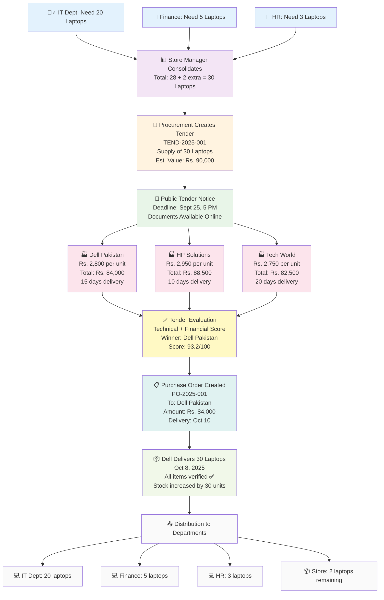
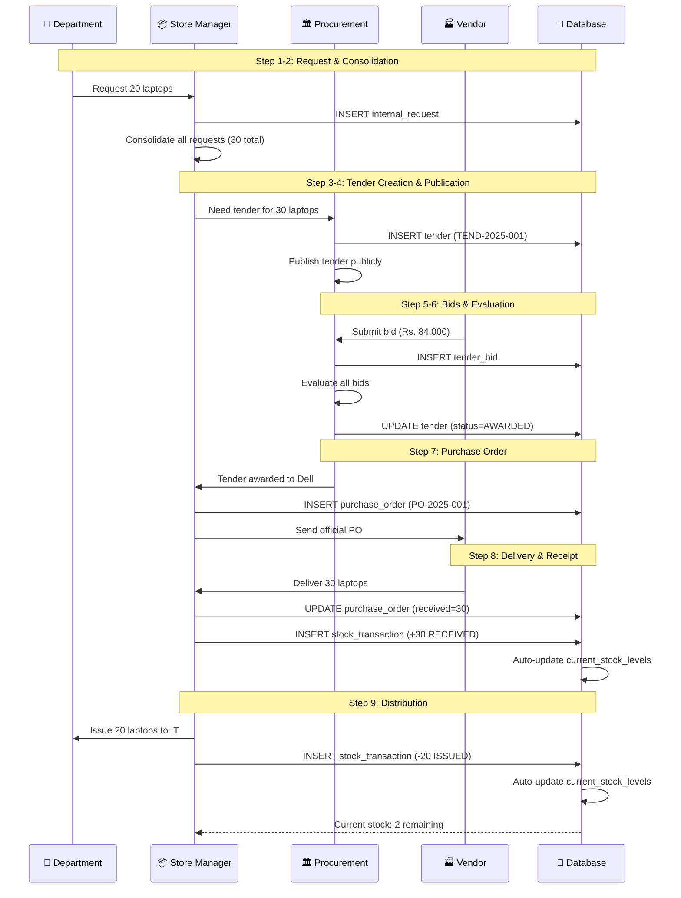
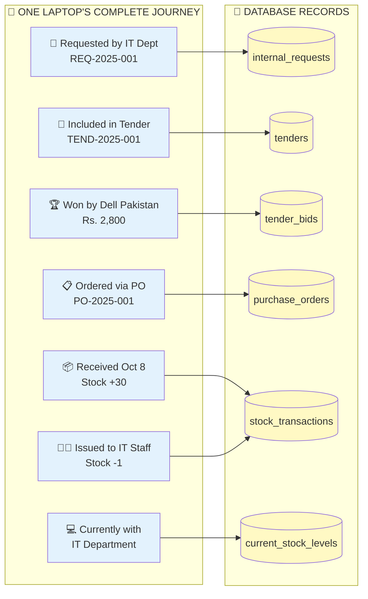

```mermaid
flowchart TD
    %% STEP 1: DEPARTMENT REQUESTS
    A1[🙋‍♂️ IT Dept: Need 20 Laptops] 
    A2[💼 Finance: Need 5 Laptops]
    A3[👥 HR: Need 3 Laptops]
    
    %% STEP 2: CONSOLIDATION
    B1[📊 Store Manager Consolidates<br/>Total: 28 + 2 extra = 30 Laptops]
    
    %% STEP 3: TENDER CREATION
    C1[🏢 Procurement Creates Tender<br/>TEND-2025-001<br/>Supply of 30 Laptops<br/>Est. Value: Rs. 90,000]
    
    %% STEP 4: TENDER PUBLICATION
    D1[📢 Public Tender Notice<br/>Deadline: Sept 25, 5 PM<br/>Documents Available Online]
    
    %% STEP 5: VENDOR BIDS
    E1[🏭 Dell Pakistan<br/>Rs. 2,800 per unit<br/>Total: Rs. 84,000<br/>15 days delivery]
    E2[🏭 HP Solutions<br/>Rs. 2,950 per unit<br/>Total: Rs. 88,500<br/>10 days delivery] 
    E3[🏭 Tech World<br/>Rs. 2,750 per unit<br/>Total: Rs. 82,500<br/>20 days delivery]
    
    %% STEP 6: EVALUATION
    F1[✅ Tender Evaluation<br/>Technical + Financial Score<br/>Winner: Dell Pakistan<br/>Score: 93.2/100]
    
    %% STEP 7: PURCHASE ORDER
    G1[📋 Purchase Order Created<br/>PO-2025-001<br/>To: Dell Pakistan<br/>Amount: Rs. 84,000<br/>Delivery: Oct 10]
    
    %% STEP 8: GOODS RECEIPT
    H1[📦 Dell Delivers 30 Laptops<br/>Oct 8, 2025<br/>All items verified ✅<br/>Stock increased by 30 units]
    
    %% STEP 9: DISTRIBUTION
    I1[📤 Distribution to Departments]
    I2[💻 IT Dept: 20 laptops]
    I3[💻 Finance: 5 laptops] 
    I4[💻 HR: 3 laptops]
    I5[📦 Store: 2 laptops remaining]
    
    %% CONNECTIONS
    A1 --> B1
    A2 --> B1  
    A3 --> B1
    B1 --> C1
    C1 --> D1
    D1 --> E1
    D1 --> E2
    D1 --> E3
    E1 --> F1
    E2 --> F1
    E3 --> F1
    F1 --> G1
    G1 --> H1
    H1 --> I1
    I1 --> I2
    I1 --> I3
    I1 --> I4
    I1 --> I5
    
    %% STYLING
    classDef request fill:#e3f2fd
    classDef consolidation fill:#f3e5f5
    classDef tender fill:#fff3e0
    classDef publication fill:#e8f5e8
    classDef vendor fill:#fce4ec
    classDef evaluation fill:#fff9c4
    classDef purchase fill:#e0f2f1
    classDef receipt fill:#f1f8e9
    classDef distribution fill:#fafafa
    
    class A1,A2,A3 request
    class B1 consolidation
    class C1 tender
    class D1 publication
    class E1,E2,E3 vendor
    class F1 evaluation
    class G1 purchase
    class H1 receipt
    class I1,I2,I3,I4,I5 distribution
```

## 🎯 **DATABASE TRANSACTION FLOW**

```mermaid
sequenceDiagram
    participant Dept as 🏢 Department
    participant Store as 📦 Store Manager
    participant Proc as 🏛️ Procurement
    participant Vendor as 🏭 Vendor
    participant DB as 💾 Database
    
    Note over Dept,DB: Step 1-2: Request & Consolidation
    Dept->>Store: Request 20 laptops
    Store->>DB: INSERT internal_request
    Store->>Store: Consolidate all requests (30 total)
    
    Note over Store,DB: Step 3-4: Tender Creation & Publication  
    Store->>Proc: Need tender for 30 laptops
    Proc->>DB: INSERT tender (TEND-2025-001)
    Proc->>Proc: Publish tender publicly
    
    Note over Proc,DB: Step 5-6: Bids & Evaluation
    Vendor->>Proc: Submit bid (Rs. 84,000)
    Proc->>DB: INSERT tender_bid
    Proc->>Proc: Evaluate all bids
    Proc->>DB: UPDATE tender (status=AWARDED)
    
    Note over Proc,DB: Step 7: Purchase Order
    Proc->>Store: Tender awarded to Dell
    Store->>DB: INSERT purchase_order (PO-2025-001)
    Store->>Vendor: Send official PO
    
    Note over Vendor,DB: Step 8: Delivery & Receipt
    Vendor->>Store: Deliver 30 laptops
    Store->>DB: UPDATE purchase_order (received=30)
    Store->>DB: INSERT stock_transaction (+30 RECEIVED)
    DB->>DB: Auto-update current_stock_levels
    
    Note over Store,DB: Step 9: Distribution
    Store->>Dept: Issue 20 laptops to IT
    Store->>DB: INSERT stock_transaction (-20 ISSUED)
    DB->>DB: Auto-update current_stock_levels
    DB-->>Store: Current stock: 2 remaining
```

## 📊 **SIMPLE DATA TRACKING EXAMPLE**

```mermaid
graph LR
    %% LAPTOP JOURNEY
    subgraph "🎯 ONE LAPTOP'S COMPLETE JOURNEY"
        L1[📝 Requested by IT Dept<br/>REQ-2025-001]
        L2[🏢 Included in Tender<br/>TEND-2025-001] 
        L3[🏆 Won by Dell Pakistan<br/>Rs. 2,800]
        L4[📋 Ordered via PO<br/>PO-2025-001]
        L5[📦 Received Oct 8<br/>Stock +30]
        L6[👨‍💻 Issued to IT Staff<br/>Stock -1]
        L7[💻 Currently with<br/>IT Department]
    end
    
    %% DATABASE RECORDS
    subgraph "💾 DATABASE RECORDS"
        D1[(internal_requests)]
        D2[(tenders)]
        D3[(tender_bids)]
        D4[(purchase_orders)]
        D5[(stock_transactions)]
        D6[(current_stock_levels)]
    end
    
    %% CONNECTIONS
    L1 --> D1
    L2 --> D2
    L3 --> D3
    L4 --> D4
    L5 --> D5
    L6 --> D5
    L7 --> D6
    
    %% STYLING
    classDef journey fill:#e3f2fd
    classDef database fill:#fff9c4
    
    class L1,L2,L3,L4,L5,L6,L7 journey
    class D1,D2,D3,D4,D5,D6 database
```
